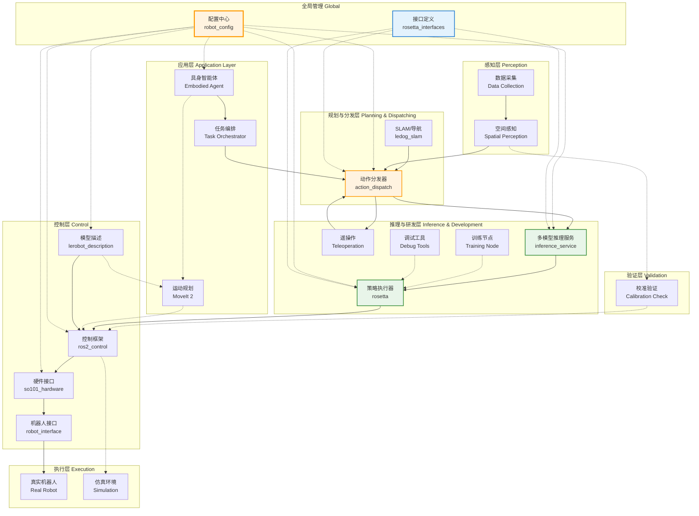
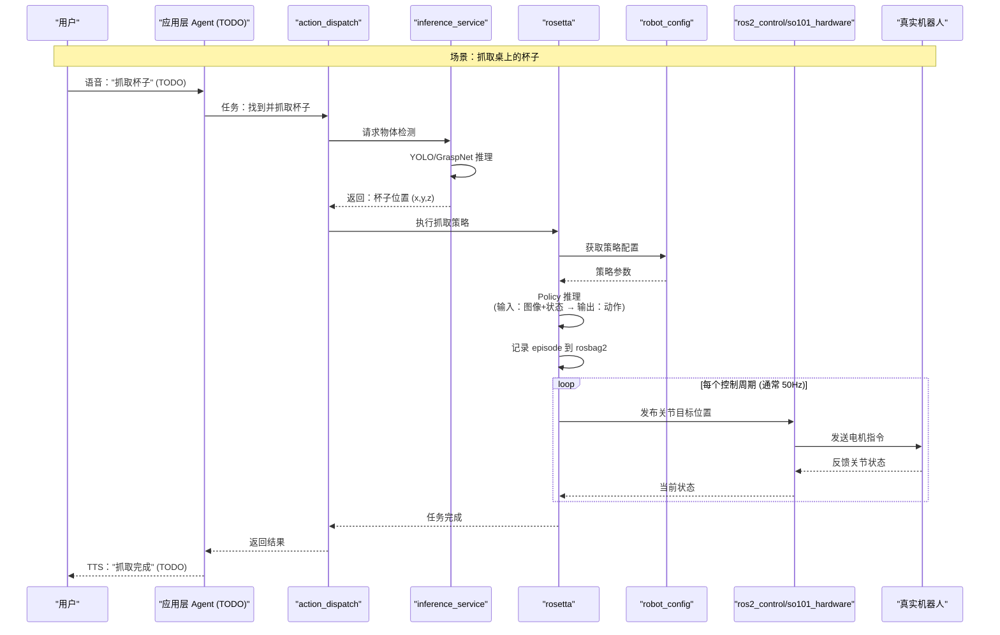
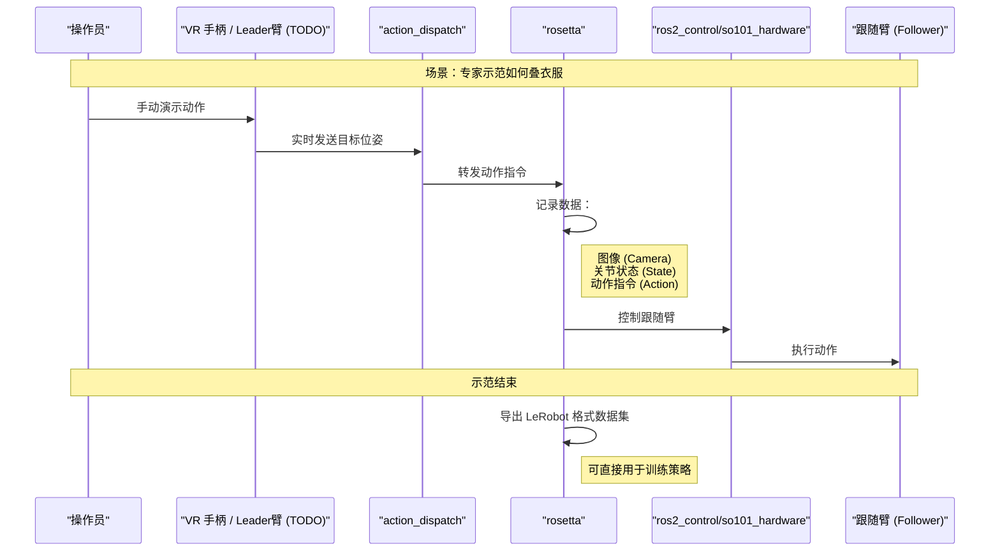
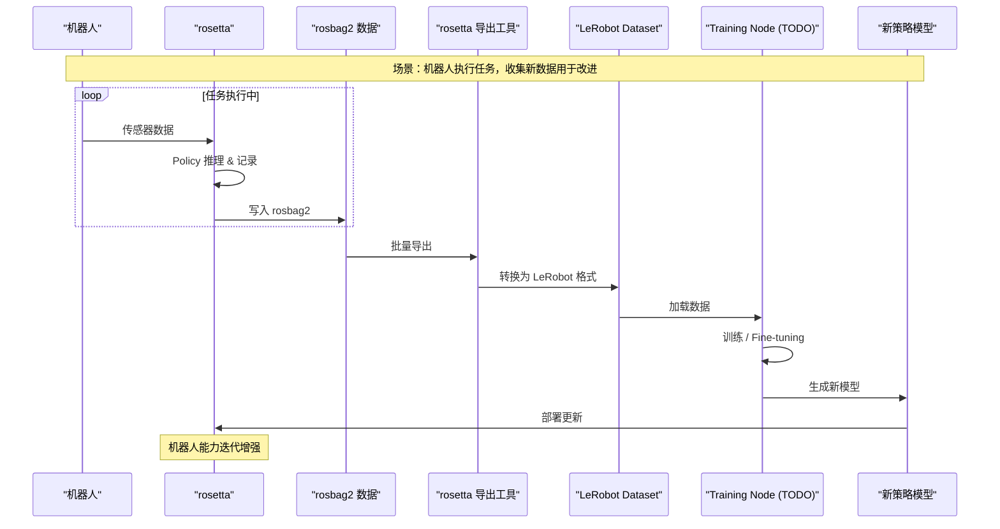

# ROS2 架构文档

> LeRobot ROS2 集成层架构说明

## 目录

- [什么是 LeRobot-ROS2？](#什么是-lerobot-ros2)
- [本架构解决了什么问题？](#本架构解决了什么问题)
- [架构全景](#架构全景)
- [核心概念解释](#核心概念解释)
- [分层设计详解](#分层设计详解)
- [数据流与交互](#数据流与交互)
- [包清单与职责](#包清单与职责)
- [路线图](#路线图)

---

## 什么是 LeRobot-ROS2？


**LeRobot** 是 Hugging Face 开源的机器人学习框架，专注于用机器学习让机器人学会执行任务（比如抓东西、叠衣服）。

**ROS2**（Robot Operating System 2）是机器人领域最常用的中间件，提供通信、硬件抽象、工具链等基础设施。

**LeRobot-ROS2** 是两者的**桥梁**：
- 把 LeRobot 训练好的 AI 模型部署到真实机器人上
- 让 ROS2 的导航、感知能力为 LeRobot 的 AI 决策服务
- 提供数据采集、训练、部署的完整工作流

```
┌─────────────────┐         ┌──────────────────┐
│  LeRobot (AI)   │ ◄─────► │   ROS2 ( infra)  │
│  - 训练策略      │         │  - 硬件控制       │
│  - 运行推理      │         │  - 通信中间件     │
│  - 数据处理      │         │  - 感知/导航      │
└─────────────────┘         └──────────────────┘
         │                            │
         └──────────┬─────────────────┘
                    ▼
         ┌──────────────────┐
         │  LeRobot-ROS2    │  ◄── 本项目
         │  集成层          │
         └──────────────────┘
```

---

## 本架构解决了什么问题？

### 问题 1：LeRobot 与 ROS2 的世界观不同

| 维度 | LeRobot | ROS2 |
|------|---------|------|
| **数据单位** | Episode（回合）| Topic（话题）|
| **时间观念** | 离散时间步 | 连续时间流 |
| **硬件抽象** | 直接控制电机 | 通过 ros2_control |
| **部署方式** | Python 脚本 | ROS2 节点 |

**解决**：通过 `rosetta` 包做协议转换，让两者"说同一种语言"。

### 问题 2：从实验室到真实机器人

实验室环境 → 代码训练 → 部署到真实机器人，中间有大量工程问题：
- 传感器数据怎么标准化？
- 多模型怎么协同？（VLA 做决策 + GraspNet 做抓取）
- 怎么记录数据用于再训练？

**解决**：提供分层架构，每层只关心自己的职责。

### 问题 3：数据采集与回流

要让机器人学得更好，需要：
1. 采集专家示范数据
2. 用这些数据训练策略
3. 部署策略，收集新数据
4. 回流数据，继续训练

**解决**：统一的数据格式（MCAP/rosbag2 ↔ LeRobot 格式）。

---

## 架构全景

### 整体架构图



### 架构设计原则

1. **分层解耦**：每层只与相邻层通信，上层不关心下层实现细节
2. **配置驱动**：所有参数通过 `robot_config` 管理，一处修改，全局生效
3. **仿真先行**：相同的代码能在仿真和真实环境无缝切换
4. **数据闭环**：支持从数据采集 → 训练 → 部署 → 再采集的完整循环

---

## 核心概念解释

### 1. 具身智能（Embodied AI）

传统 AI 只需要"看"和"说"（比如 ChatGPT），具身 AI 还需要：
- **感知**：通过传感器理解环境
- **决策**：决定做什么动作
- **执行**：真正动起来

```
感知 ──► 决策 ──► 执行
 ↑                  │
 └──────────────────┘
   (反馈闭环)
```

### 2. 策略（Policy）

在机器人学习中，**策略**是一个函数：
```
动作 = Policy(观察)
```
- **观察**：机器人看到的（图像）、感受到的（关节角度）
- **动作**：机器人要做的（移动关节、抓东西）

LeRobot 训练的就是这个 `Policy` 函数，通常是一个神经网络。

### 3. 数据格式

| 格式 | 用途 | 说明 |
|------|------|------|
| **rosbag2/MCAP** | ROS2 原生 | 记录 ROS2 话题数据 |
| **LeRobot Dataset** | 训练用 | Hugging Face datasets 格式 |
| **Episode** | LeRobot 概念 | 一个完整任务的数据（从开始到结束）|

**转换**：`rosetta` 包提供 rosbag2 ↔ LeRobot 格式的双向转换。

### 4. ros2_control

ROS2 的硬件抽象框架，把你的电机、传感器包装成标准接口：

```
你的代码 ──► ros2_control ──► 电机驱动
               │
               ├──► SO101 电机
               ├──► 摄像头
               └──► 力传感器
```

好处：换硬件不需要改业务代码。

### 5. VLA / VLN / GraspNet

这些都是视觉相关的 AI 模型：

- **VLA** (Vision-Language-Action)：看图 + 听指令 → 输出动作
  - 例子：你说"把红色方块放到左边"，它就知道怎么做
  
- **VLN** (Vision-Language-Navigation)：看图 + 听指令 → 导航到某地
  - 例子："去厨房拿苹果"
  
- **GraspNet**：看物体 → 输出最佳抓取点
  - 例子：看到杯子，知道从哪里抓最稳

---

## 分层设计详解

### 第 1 层：应用层（Application Layer）

**职责**：最高层智能，理解人类意图，做高层决策

| 组件 | 状态 | 功能描述 |
|------|------|----------|
| **具身智能体 (Embodied Agent)** | 规划中 | 集成 ASR(语音识别)/TTS(语音合成)/VLM(视觉语言模型)，能理解自然语言指令 |
| **任务编排 (Task Orchestrator)** | 规划中 | 把复杂任务拆解为子任务，用行为树(BT)管理执行流程 |
| **MoveIt 2** | 规划中 | 运动规划库，负责机械臂避障、路径规划 |

**什么时候用到？**
- 你说："帮我把桌上的书放到书架上"
- 应用层理解意图 → 拆解成：找书 → 抓书 → 导航到书架 → 放书

---

### 第 2 层：规划与分发层（Planning & Dispatching）

**职责**：承上启下，把高层指令转换成可执行的动作

| 组件 | 状态 | 功能描述 |
|------|------|----------|
| **ledog_slam** | 已实现 | SLAM（同步定位与地图构建）+ Nav2 导航，让机器人知道自己在哪、怎么去目的地 |
| **action_dispatch** | 已实现 | 动作分发器，决定当前动作由谁来执行（AI策略 / 遥操作 / 预设程序）|

**工作流程**：
```
应用层指令: "抓取前方物体"
         │
         ▼
action_dispatch 决定：
  - 使用 inference_service 检测物体位置
  - 使用 rosetta 执行抓取策略
         │
         ▼
分发到具体执行模块
```

---

### 第 3 层：推理与研发层（Inference & Development）

**职责**：运行 AI 模型，支持数据采集与训练

| 组件 | 状态 | 功能描述 |
|------|------|----------|
| **rosetta** | 已实现 | **核心组件**。ROS2-LeRobot 桥接器，运行策略模型，记录数据到 rosbag2，导出 LeRobot 格式 |
| **inference_service** | 已实现 | 多模型推理框架，支持 VLA/YOLO/GraspNet 等模型，提供统一的模型部署接口 |
| **rosetta_interfaces** | 已实现 | 定义了本层使用的 ROS2 接口（messages/services/actions）|
| **训练节点 (Training Node)** | 规划中 | 支持本地或分布式训练，与 rosetta 共享配置协议 |
| **遥操作 (Teleoperation)** | 规划中 | 支持 VR 头显、Leader臂、手机 IMU 等输入，用于采集专家示范数据 |
| **调试工具 (Debug Tools)** | 规划中 | 可视化工具，如 Attention Score 热力图，看 AI "关注"图像的哪个区域 |

**rosetta 的关键功能**：
1. **Policy Runner**：加载并运行 LeRobot 策略模型
2. **Contract-driven**：通过合约文件定义输入输出，策略与代码解耦
3. **Data Recorder**：自动记录 episode 到 rosbag2（MCAP 格式）
4. **Data Exporter**：将 rosbag2 导出为 LeRobot 训练格式

---

### 第 4 层：感知层（Perception）

**职责**：理解环境，提供标准化的感知数据

| 组件 | 状态 | 功能描述 |
|------|------|----------|
| **ledog_slam** | 已实现 | 通过摄像头/LiDAR 构建地图，定位机器人在地图中的位置 |
| **数据采集** | 已实现 | 标准化图像、点云、关节状态等数据格式 |

**输出数据**：
- 机器人在地图中的位姿 (x, y, θ)
- 障碍物地图
- 物体检测结果

---

### 第 5 层：验证层（Validation）

**职责**：确保感知与执行的一致性

| 组件 | 状态 | 功能描述 |
|------|------|----------|
| **校准验证工具** | 规划中 | 验证"传感器看到的位置"与"电机实际位置"是否一致，防止零点偏移 |

**为什么要这个？**
- 机器人用久了，关节零点可能偏移
- 摄像头看到的抓取点和实际执行有偏差
- 定期校准确保精度

---

### 第 6 层：控制层（Control）

**职责**：硬件抽象，让上层代码不感知硬件差异

| 组件 | 状态 | 功能描述 |
|------|------|----------|
| **ros2_control** | 已集成 | ROS2 控制框架，提供标准硬件接口 |
| **so101_hardware** | 已实现 | SO101 机器人的硬件接口包，实现 ros2_control 的 HardwareInterface |
| **lerobot_description** | 已实现 | URDF/SRDF 模型文件，描述机器人 kinematics 和 collision |
| **robot_interface** | 已实现 | LeRobot 内置机器人的适配层 |

**ros2_control 的作用**：
```
┌─────────────────────────────────────┐
│         你的业务代码                 │
│    (rosetta / MoveIt / 其他)        │
└─────────────────────────────────────┘
                   │
                   ▼
┌─────────────────────────────────────┐
│         ros2_control                │
│  - Controller Manager               │
│  - Joint State Controller           │
│  - Position/Velocity Controllers    │
└─────────────────────────────────────┘
                   │
                   ▼
┌─────────────────────────────────────┐
│         so101_hardware              │
│  - HardwareInterface 实现            │
│  - 与真实电机通信                    │
└─────────────────────────────────────┘
```

---

### 第 7 层：执行层（Execution）

**职责**：真正的物理执行或仿真

| 环境 | 说明 |
|------|------|
| **真实机器人** | SO101 或其他支持的机器人 |
| **Gazebo** | ROS2 原生仿真器 |
| **MuJoCo** | 物理仿真器，LeRobot 常用 |
| **Isaac Sim** | NVIDIA 的高性能仿真器 |

**切换方式**：通过 `robot_config` 切换，业务代码不用改。

---

### 第 8 层：全局管理（Global Management）

**职责**：贯穿所有层的配置和接口管理

| 组件 | 状态 | 功能描述 |
|------|------|----------|
| **robot_config** | 已实现 | 配置中心，管理机器人参数、URDF 路径、控制参数等 |
| **rosetta_interfaces** | 已实现 | 全局接口定义，确保各模块通信协议一致 |

---

## 数据流与交互

### 典型场景 1：AI 自主抓取



### 典型场景 2：遥操作数据采集



### 典型场景 3：数据回流再训练



---

## 包清单与职责

### 已实现的包

| 包名 | 类型 | 依赖 | 核心职责 |
|------|------|------|----------|
| `robot_config` | 配置 | - | 全局配置中心，管理 URDF 路径、控制参数、关节限制等 |
| `action_dispatch` | 动作 | rosetta_interfaces | Pull-based 动作分发，仲裁多来源指令 |
| `rosetta` | 推理 | rosetta_interfaces | Policy 执行器，rosbag2 记录，LeRobot 格式导出 |
| `inference_service` | 推理 | rosetta_interfaces | 多模型推理框架，支持 VLA/YOLO/GraspNet |
| `rosetta_interfaces` | 接口 | - | 定义 ROS2 消息、服务、动作类型 |
| `ledog_slam` | 感知 | - | SLAM 与导航，提供定位和地图 |
| `so101_hardware` | 控制 | ros2_control | SO101 硬件接口实现 |
| `lerobot_description` | 模型 | - | URDF/SRDF 模型文件 |
| `robot_interface` | 接口 | - | LeRobot 机器人适配层 |

### 规划中的包

| 包名 | 类型 | 说明 |
|------|------|------|
| `embodied_agent` | 应用 | 具身智能体，集成 ASR/TTS/VLM |
| `task_orchestrator` | 应用 | 任务编排与行为树 |
| `training_node` | 推理 | 分布式训练节点 |
| `teleoperation` | 推理 | 遥操作输入接口 |
| `debug_tools` | 工具 | 可视化调试工具 |
| `calibration_tool` | 验证 | 校准验证工具 |

---

## 路线图

### Phase 1: 基础架构（当前）✅
- [x] `robot_config` 配置中心
- [x] `rosetta` Policy 执行器
- [x] `inference_service` 推理服务
- [x] `action_dispatch` 动作分发
- [x] `so101_hardware` 硬件接口
- [x] `lerobot_description` 模型描述
- [x] 数据记录与导出流程

### Phase 2: 感知与验证 🔧
- [x] `ledog_slam` SLAM 与导航
- [ ] 校准验证工具
- [ ] 传感器融合

### Phase 3: 高级功能 🚧
- [ ] 遥操作系统（VR / Leader臂）
- [ ] 训练节点（本地/分布式）
- [ ] Attention 可视化调试工具
- [ ] MoveIt 2 集成

### Phase 4: 智能体 🤖
- [ ] 具身智能体（VLM 集成）
- [ ] 任务编排与行为树
- [ ] 自然语言交互（ASR/TTS）
- [ ] 多机器人协同

---

## 快速开始

### 1. 启动配置中心
```bash
ros2 run robot_config config_server
```

### 2. 启动硬件接口
```bash
ros2 launch so101_hardware robot.launch.py
```

### 3. 启动 rosetta（策略执行）
```bash
ros2 run rosetta policy_runner --ros-args -p policy_path:=/path/to/policy.pt
```

### 4. 启动动作分发
```bash
ros2 run action_dispatch dispatcher_node
```

### 5. 查看数据流
```bash
ros2 topic list
ros2 topic echo /joint_states
```

---

## 常见问题

### Q: 我还没有真实机器人，能测试吗？
**A**: 可以。通过配置切换到仿真模式：
```yaml
# robot_config/config/simulation.yaml
environment: "gazebo"  # 或 "mujoco", "isaac_sim"
```

### Q: 怎么采集自己的数据集？
**A**: 两种方式：
1. **遥操作**：启动 teleoperation（TODO）+ rosetta，手动示范，自动记录
2. **脚本生成**：用 Python 脚本生成合成数据，通过 rosetta 导入

### Q: 怎么部署自己训练的策略？
**A**:
1. 训练好的策略保存为 `.pt` 文件
2. 启动 rosetta：`ros2 run rosetta policy_runner -p policy_path:=/path/to/policy.pt`
3. rosetta 会自动加载并运行

### Q: 这套架构支持其他机器人吗？
**A**: 支持。需要：
1. 编写该机器人的 `xxx_hardware` 包（实现 ros2_control 接口）
2. 提供 URDF 模型到 `lerobot_description`
3. 配置 `robot_config` 指向新机器人

---

**最后更新**：2026-02-11
**维护者**：LeRobot-ROS2 团队
**问题反馈**：https://github.com/anomalyco/opencode/issues